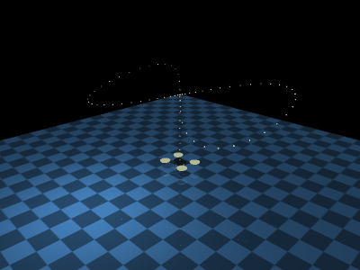
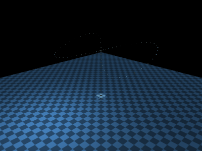

# control systems: PID, LQR, and MPC

Both drones follow a path shaped like a sideways number eight: **∞**. This is
often called a *figure-eight trajectory*. It is simply two connected loops—the
drone flies the right loop, crosses the center, flies the left loop, and returns
to the center.

## Run

```bash

conda env create -f environment.yml
conda activate mujoco-drones

# macOS (use `python` instead of `mjpython` on Linux/Windows)
mjpython main.py --drone skydio --controller pid
mjpython main.py --drone skydio --controller lqr
mjpython main.py --drone skydio --controller mpc
```

Use `--drone crazyflie` for the other drone. Rebuild all GIFs with:

```bash
python assets/record_gifs.py
```

Yellow dots are the reference path. The green dot is the current target.

## Shared model

All controllers receive the state

$$x=[p_x,p_y,p_z,v_x,v_y,v_z]^T$$

and return acceleration $u=[a_x,a_y,a_z]^T$. With control period
$\Delta t=0.05\text{ s}$, the prediction model is

$$p_{k+1}=p_k+\Delta t\,v_k+\frac{1}{2}\Delta t^2u_k$$

$$v_{k+1}=v_k+\Delta t\,u_k$$

or $x_{k+1}=Ax_k+Bu_k$, with

$$A=\begin{bmatrix}I_3&\Delta t I_3\\0&I_3\end{bmatrix},\qquad
B=\begin{bmatrix}\frac{1}{2}\Delta t^2 I_3\\\Delta t I_3\end{bmatrix}.$$

Every acceleration component is limited to
$[-6,6]\text{ m/s}^2$. MuJoCo runs at $0.01\text{ s}$ and receives force

$$F=m\left(u+[0,0,9.81]^T\right).$$

The complete feedback loop is:

```text
sideways-8 reference -> controller -> desired acceleration
         ^                                 |
         |                                 v
measured position/velocity <- MuJoCo <- F = m(a + g)
```

Thus, PID, LQR, and MPC produce the same kind of command. They differ only in
how they calculate that command from the measured state and reference.

Only the mass and reference size differ between drones:

| Parameter | Skydio X2 | Crazyflie 2 |
|---|---:|---:|
| Mass used | 1.325 kg | 0.028 kg |
| Visual envelope | 0.660 × 0.560 × 0.203 m | 0.115 × 0.115 × 0.0295 m |
| Opposite motor spacing | 0.584 m | 0.0919 m |
| Joint ranges: x / y / z | ±2.3 / ±1.3 / 0–1.8 m | ±0.9 / ±0.5 / 0–1.05 m |
| Path radius $r$ | 2.0 m | 0.8 m |
| Nominal path height $h$ | 1.4 m | 0.75 m |

Dimensions and inertia are not part of this simplified controller model because
rotation is disabled. A full quadrotor controller would need attitude, inertia,
motor thrust, and torque.

## Reference path: a sideways eight (∞)

Viewed from above, the movement is:

```text
center -> right loop -> center -> left loop -> center
```

This path is useful for learning because the controller must change x and y
together, reverse direction at the center, and handle curved motion. A small
height change makes it a 3D path rather than a flat one.

Takeoff lasts 1.5 s, the sideways-8 path lasts 7 s, landing lasts 1.5 s, and
the drone pauses for 1 s. Smoothstep $s(\tau)=3\tau^2-2\tau^3$ prevents an
abrupt start and stop. During the two loops, $\theta=2\pi s(\tau)$ and

$$p_r(\theta)=
\begin{bmatrix}
r\sin\theta\\
\frac{r}{2}\sin(2\theta)\\
h\left(1+0.18\sin(2\theta)\right)
\end{bmatrix}.$$

Here, $r$ controls the horizontal size and $h$ is the normal flight height.
The $\sin(\theta)$ and $\sin(2\theta)$ terms create the two connected loops;
the final term adds a small altitude change.

## PID

PID is a model-free feedback controller: it does not predict the drone or know
its mass. It only observes tracking error and combines three reactions:

- **Proportional (P):** responds to the current error. Larger error produces a
  larger correction.
- **Integral (I):** remembers past error. It removes persistent offset, but too
  much can cause overshoot.
- **Derivative (D):** reacts to how quickly the error changes. It adds damping
  and reduces oscillation.

### General equation

For reference $r(t)$, measured output $y(t)$, and error $e(t)=r(t)-y(t)$,

$$u(t)=K_Pe(t)+K_I\int_0^t e(\tau)\,d\tau+K_D\frac{de(t)}{dt}.$$

### Applied to our drone

The measured output is position $y=p$, so $e_p=p_r-p$. Because velocity is
available from MuJoCo, the derivative error is taken directly as
$e_v=v_r-v$. The discrete implementation is

$$u=K_Pe_p+K_I\int e_p\,dt+K_De_v.$$

Parameters: $K_P=7$, $K_I=0.15$, $K_D=4.5$. The integral is limited to
$[-2,2]$ per axis to reduce windup, and $u$ is clipped to $\pm6\text{ m/s}^2$.
That acceleration is converted to force with $F=m(u+g)$. PID is simple and
cheap, but it cannot see future turns and its gains must be tuned manually.

| Skydio X2 | Crazyflie 2 |
|---|---|
|  |  |

## LQR

LQR is a model-based state-feedback controller. Unlike three independent PID
terms, it uses the complete linear state model $x_{k+1}=Ax_k+Bu_k$. It balances
tracking error against control effort and calculates one constant, optimal gain
matrix $K$ before simulation starts.

### General equations

For a discrete linear system

$$x_{k+1}=Ax_k+Bu_k,$$

LQR minimizes

$$J=\sum_{k=0}^{\infty}\left(x_k^TQx_k+u_k^TRu_k\right),$$

where $Q$ penalizes state error and $R$ penalizes control effort. The discrete
algebraic Riccati equation is

$$P=A^TPA-A^TPB(R+B^TPB)^{-1}B^TPA+Q,$$

and the optimal feedback is

$$K=(R+B^TPB)^{-1}B^TPA,\qquad u_k=-Kx_k.$$

### Applied to our drone

For trajectory tracking, the controller uses error $e=x-x_r$ instead of $x$:

$$u=-Ke.$$

Here $x=[p_x,p_y,p_z,v_x,v_y,v_z]^T$ and

The diagonal entries of $Q$ are $[35,35,45,3,3,4]$ (all other entries are
zero), and $R=0.25I_3$.

The gain used by the code is

$$K=\begin{bmatrix}
10.1931&0&0&5.4122&0&0\\
0&10.1931&0&0&5.4122&0\\
0&0&11.3944&0&0&5.8591
\end{bmatrix}.$$

At runtime LQR only performs the matrix multiplication $u=-Ke$, so it is very
fast. Its output is treated as desired x/y/z acceleration, clipped to
$\pm6\text{ m/s}^2$, and converted to force. However, LQR reacts to the current
reference rather than previewing the future path, and clipping is not part of
the original unconstrained LQR solution.

| Skydio X2 | Crazyflie 2 |
|---|---|
|  |  |

## MPC

MPC is also model-based, but it repeatedly plans ahead instead of using one
fixed gain. At every control update it:

1. Measures the current state.
2. Predicts the drone and reference over $N=20$ steps, or 1 second.
3. Finds the best bounded sequence of 20 acceleration commands.
4. Applies only the first command and solves again from the next measured state.

### General equations

For a model $x_{k+1}=f(x_k,u_k)$, MPC solves a finite-horizon problem:

$$\min_{u_0,\ldots,u_{N-1}}
\sum_{k=1}^{N}\lVert x_k-x_{r,k}\rVert_Q^2
+\sum_{k=0}^{N-1}\lVert u_k\rVert_R^2$$

subject to the model and state/input constraints. Only $u_0$ is applied; this
repeated replanning is called a **receding horizon**.

### Applied to our drone

Our model is the linear double integrator $x_{k+1}=Ax_k+Bu_k$. At every update,
MPC predicts $N=20$ steps (1 second) and solves

$$\min_{u_0,\ldots,u_{N-1}}
\sum_{k=1}^{N}(x_k-x_{r,k})^TQ(x_k-x_{r,k})
+\sum_{k=0}^{N-1}u_k^TRu_k$$

subject to $x_{k+1}=Ax_k+Bu_k$ and $-6\le u_k\le6$. It uses the same $Q$ and
$R$ as LQR. The first optimized x/y/z acceleration is converted to force and
applied for 0.05 s. MPC can directly respect acceleration limits and anticipate
turns, but solving an optimization problem each update costs more computation.

| Skydio X2 | Crazyflie 2 |
|---|---|
|  |  |

## One-cycle tracking error

| Controller | Skydio RMSE | Crazyflie RMSE |
|---|---:|---:|
| PID | 0.361 m | 0.119 m |
| LQR | 0.324 m | 0.091 m |
| MPC | 0.072 m | 0.030 m |

PID and LQR react to the current reference. MPC performs better on this fast
path because it also sees the upcoming reference.

## Files

- `controllers.py`: trajectory, PID, LQR, and MPC.
- `main.py`: viewer and shared control loop.
- `models/`: the two MuJoCo models.
- `assets/record_gifs.py`: deterministic offscreen GIF generation.
